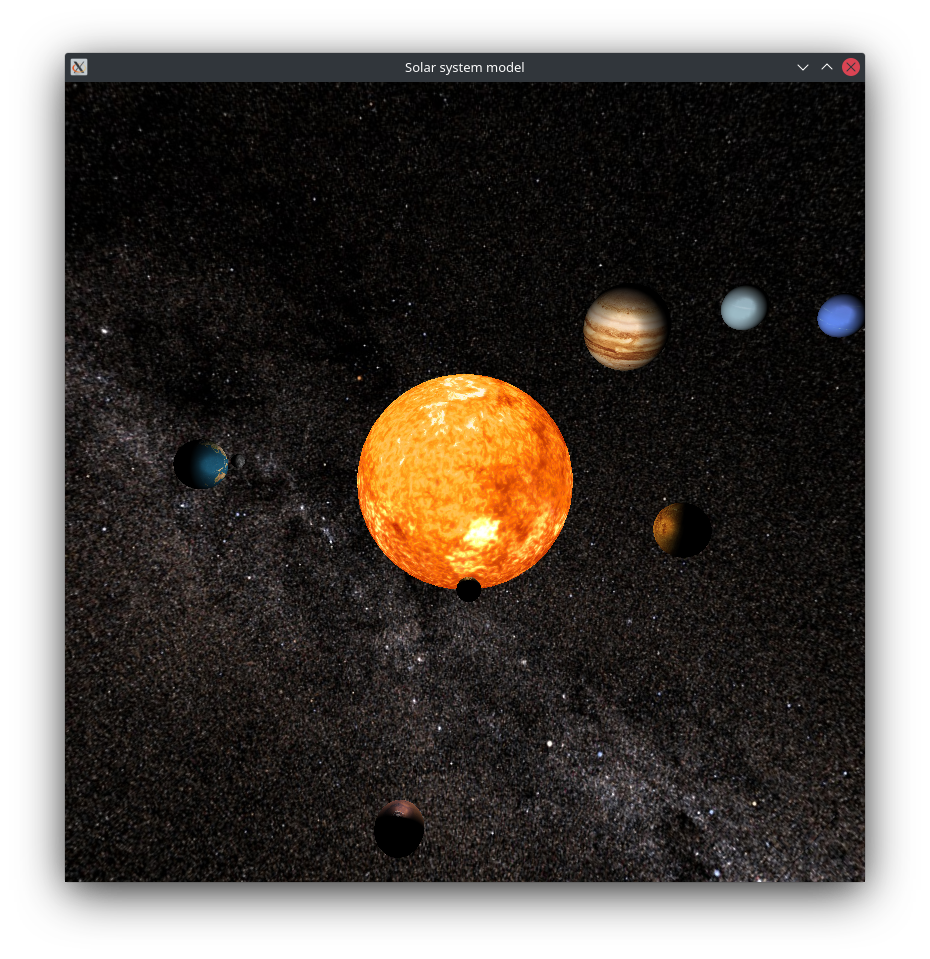

# A simple 3D model of the Solar System

Written in C++ using OpenGL and FreeGLUT library.

## Screenshot



## Generate a native build system:

### Release mode:

```sh
cd release
cmake -DCMAKE_BUILD_TYPE=Release ..
```

### Debug mode:

```sh
cd debug
cmake -DCMAKE_BUILD_TYPE=Debug ..
```

## Compile/link the project:

In `release` or `debug` directory:

```sh
cmake --build .
```

## Run:

In `release` or `debug` directory:

```sh
./main
```
